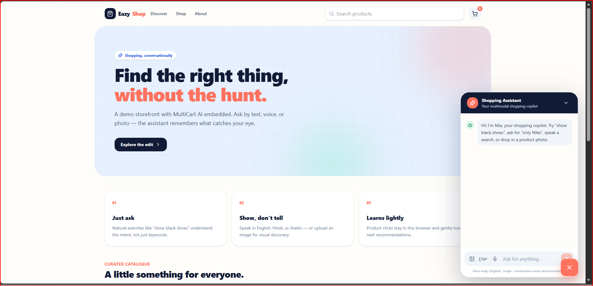
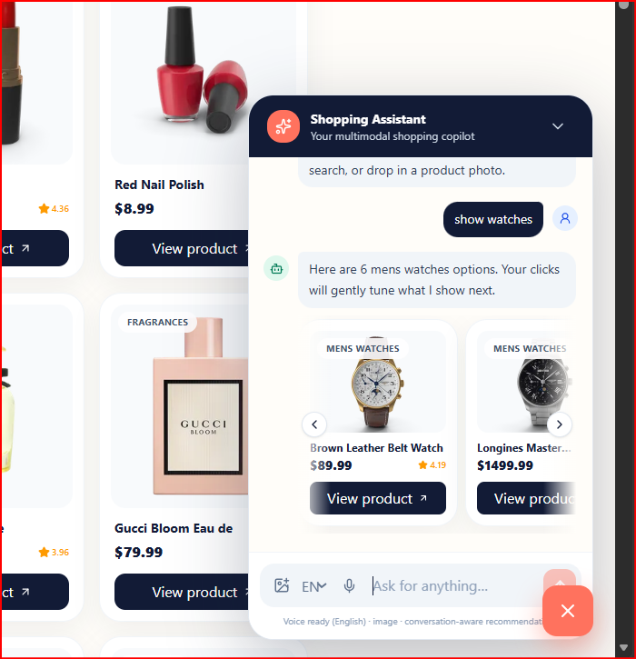
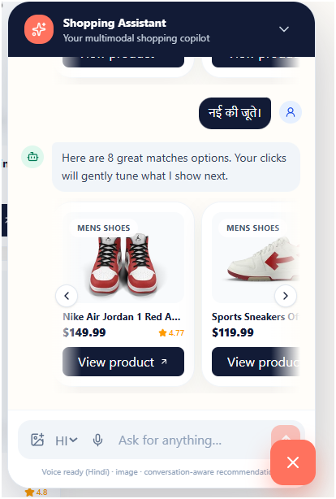
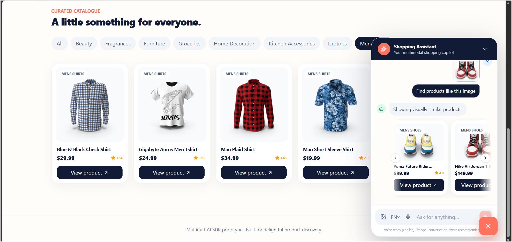

# EazyCart AI – Multimodal Shopping Assistant


EazyCart AI is a full-stack AI-powered shopping assistant prototype designed to improve product discovery through conversational search, voice interaction, and image-based recommendations.

The prototype demonstrates how an intelligent shopping copilot can be integrated into modern e-commerce platforms to deliver personalized and context-aware shopping experiences.

## Live Demo

**Frontend:**  
https://multi-cart-1p9l7jsgp-prajwal955.vercel.app

**Backend API:**  
https://multicart-backend-anjx.onrender.com

## Application Preview

| Home Page | Conversational Search |
|------------|------------|
|  |  |

| Voice Search | Image Search |
|------------|------------|
|  |  |


## Project Highlights

- Conversational product discovery using natural language
- Voice-enabled product search
- Image-based visual product discovery
- Context-aware recommendation engine
- Session-based preference learning
- Personalized product ranking
- Explainable recommendation responses
- Responsive across desktop and mobile devices

## Tech Stack

### Frontend
- React
- Vite
- Tailwind CSS

### Backend
- FastAPI
- Python

### Deployment
- Vercel (Frontend)
- Render (Backend)

### External API
- DummyJSON Product API

## System Workflow

```text
User Input (Text / Voice / Image)
            ↓
      React Frontend
            ↓
 FastAPI Recommendation Engine
            ↓
Intent Analysis & Preference Learning
            ↓
      Product Ranking
            ↓
 Personalized Recommendations
```

## Core Functionalities

### Conversational Search

Users can discover products using natural language queries.

Examples:

- "Show black shoes"
- "Only Nike products"
- "Suggest laptops"

### Voice Search

Users can interact with the shopping assistant using voice commands for hands-free product discovery.

### Visual Search

Users can upload product images to receive visually similar product recommendations.

### Personalized Recommendations

Recommendations are generated based on:

- Product categories
- Brands
- Colors
- User preferences
- Previous interactions

## Future Enhancements

- CLIP-based image embeddings
- LLM-powered conversational assistant
- Real e-commerce platform integration
- User authentication and profiles
- Wishlist and cart personalization
- Multilingual recommendation support
- Analytics dashboard

## Author

**Prajwal M**

GitHub: https://github.com/PrajwalM955
